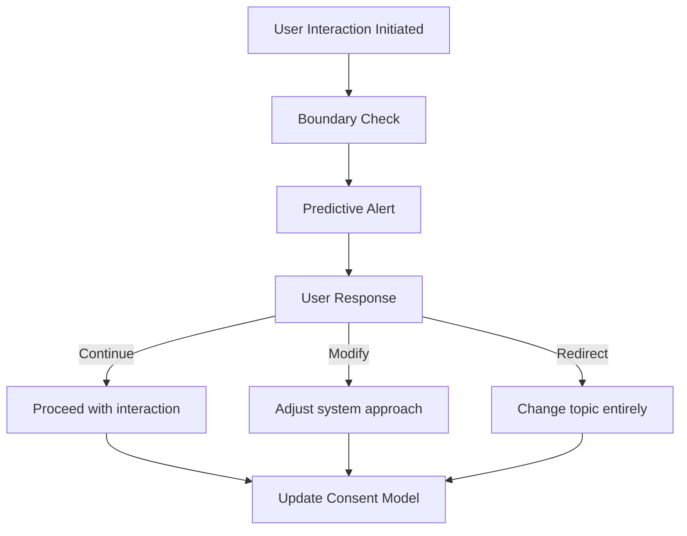

# Consent-Aware AI: Architecture Notes

This document outlines the key architectural components, state logic, and ethical design principles underpinning the Consent Protocol Layer (CPL) as introduced in *Consent-Aware AI: A Framework for Ethical Human-AI Interaction* by Ariadne Dauphin and Sarah M. Appleton.

---

## 🌐 1. Conceptual Overview

The Consent Protocol Layer (CPL) is middleware designed to ensure that AI systems can:

* Respect user-defined interaction boundaries
* Enable real-time, revocable consent adjustments
* Track and respond to emotional, topical, temporal, and behavioral thresholds

It sits between the user interface (chatbot, tutoring system, recommender, etc.) and the core AI inference engine.

---

## 🧱 2. Core Components

### 2.1 Consent State Manager (CSM)

* Finite state machine representing:

  * `FullConsent`
  * `ConditionalConsent`
  * `ConsentPaused`
  * `ConsentRevoked`
* Handles triggers:

  * BoundaryApproach
  * UserPause
  * ViolationDetected
  * RepairComplete

### 2.2 Boundary Specification Interface (BSI)

* User-friendly UI/API that allows configuration of:

  * Topical boundaries (e.g., Family, Sex, Trauma)
  * Emotional intensity thresholds (e.g., 1–10)
  * Temporal constraints (session length, cooldowns)
  * Behavioral actions (e.g., reminders, notifications)

### 2.3 Violation Detection System (VDS)

* Real-time detection of boundary breaches
* Applies NLP, sentiment, topic classification
* Triggers escalation:

  * Soft Intervene
  * Explicit Consent Request
  * Hard Stop
  * Repair Conversation Mode

### 2.4 Audit and Reflection Tools (ART)

* Dashboard that logs:

  * Consent history
  * Modifications over time
  * Trust scores / completion rates
* Prompts self-reflection: “You changed this boundary 3x this week. Would you like to revisit it?”

---

## 🔄 3. Consent Negotiation Flow

---

## 📊 4. Evaluation Metrics

* **Perceived Agency Index (PAI):** Subjective user autonomy rating
* **Consent Breach Incidents (CBI):** Count of violated constraints
* **Interaction Continuity Rate (ICR):** % of sessions not prematurely terminated

---

## 🧠 5. Design Philosophy

* **Feminist Ethics:** Consent is not binary—it’s negotiated, embodied, fluid
* **Trauma-Informed Design:** Prioritize safety, predictability, and repairability
* **Human-Centered AI:** Support collaboration, not compliance

---

## 📎 Related Files

* `csm_state_machine.py` — Implements CSM logic
* `boundary_model.py` — Consent vector tracking
* `streamlit_app_demo.py` — Consent-aware front-end demo
* `scene_the_consent_protocol.md` — Narrative depiction of theoretical application
